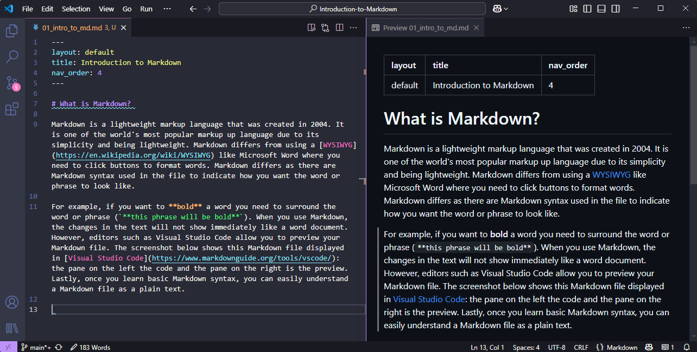

# What is Markdown?
{: .no_toc }

Markdown is a lightweight markup language that was created in 2004. It is one of the world's most popular markup languages due to its simplicity and being lightweight. Markdown differs from using a [WYSIWYG](https://en.wikipedia.org/wiki/WYSIWYG) like Microsoft Word, where you need to click buttons to format words. Markdown syntax is used in the file to indicate how you want the word or phrase to look like.

For example, if you want to **bold** a word, you need to surround the word or phrase (`**this phrase will be bold**`). When you use Markdown, the changes in the text will not show immediately like a Word document. However, editors such as Visual Studio Code allow you to preview your Markdown file. The screenshot below shows this Markdown file displayed in [Visual Studio Code](https://www.markdownguide.org/tools/vscode/): the pane on the left is the code and the pane on the right is the preview. Lastly, once you learn basic Markdown syntax, you can easily understand a Markdown file as plain text, as Markdown syntax is designed to be readable and unobtrusive.

# Why use Markdown?
{: .no_toc }

There are several reasons why you should use Markdown instead of a WYSIWYG editor. 

* Markdown is very versatile. It can be used for more than a README, it is used for notes, books (including this one), presentations, and websites.
* It is easy to learn and easy to use.
* Markdown is futureproof.

    * It will work on all operating systems.
    * It will work on all text-editing software.
    * It is non-proprietary.
    * Even if the application you are using stops working or is not being maintained anymore, you can still read your Markdown files.
    * For more information about futureproofing your project, check out our workshop on [file formats](https://ubc-library-rc.github.io/rdm/content/02_file_formats.html).

<!-- # How Does markdown work?

When you are using Markdwon, you are able to generate nice outputs for your work, but what is going on behind the scenes? -->

# What can we do with Markdown?

Given the simplicity of Markdown, it is very popular and used everywhere. Here are some examples of what you can do with Markdown:

* **Documents**: Markdown is often used for technical documentation. Sites like GitHub integrate Markdown very well, and most repositories use Markdown for the README (check out our [readme workshop](https://ubc-library-rc.github.io/rdm/content/03_create_readme.html)).

* **Websites:** You can create simple websites using Markdown (that gets rendered to HTML) using platforms like [GitHub Pages](https://pages.github.com/) or static site generators like [Hugo](https://gohugo.io/) and [Jekyll](https://gohugo.io/)

* **Books**: You can create online textbooks with Markdown. Our [Research Data Management textbook](https://ubc-library-rc.github.io/rdm/) was created with Markdown!

* **Presentations:** Presentation slides can be created with Markdown. People prefer creating slides with Markdown when they are presenting a lot of code. Our [Introduction to the Unix Shell](https://ubc-library-rc.github.io/intro-shell/slides/introduction.html#/) workshop provides slides which was created with Markdown.

# Congrats!
{: .no_toc }

You now know how the fundamentals of markdown and how to get set up and get started with markdown. Join us next time to learn markdown syntax.

### Sources
{: .no_toc }
- Markdown Guide. <https://www.markdownguide.org/>
- Basic writing and formatting. <https://docs.github.com/en/get-started/writing-on-github/getting-started-with-writing-and-formatting-on-github/basic-writing-and-formatting-syntax>
- The Ultimate Guide to Markdown. <https://gist.github.com/cuonggt/9b7d08a597b167299f0d>
- Handbook Markdown Guide. <https://handbook.gitlab.com/docs/markdown-guide/>
---

Need help?
{: .label .label-blue }
  Please reach out to `research.data@ubc.ca` for assistance with any of your research data questions.